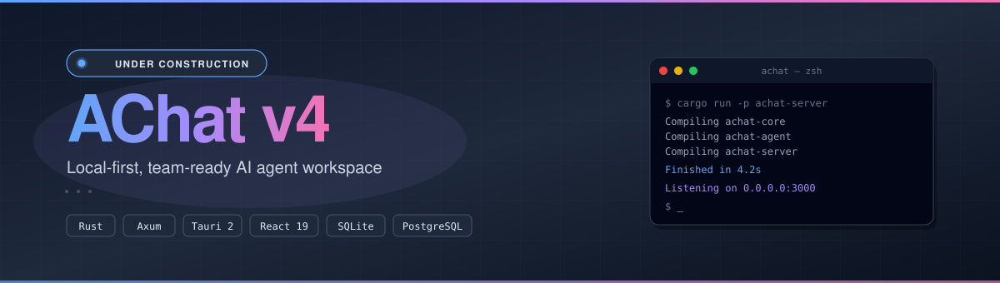

<h4 align="right"><a href="./README.md">English</a> | <strong>简体中文</strong></h4>

    

<h1 align="center">AChat</h1>

    <strong>本地优先、面向团队的 AI Agent 工作台。</strong>

    
    
    
    

 

    

---

## 关于

**AChat v4** 是项目的一次彻底重写，将其重新定位为一个 **本地优先、面向团队的 AI Agent 工作台**。

- **本地优先。** 数据保存在你自己的机器上（SQLite），可离线工作，掌控自己的历史记录。
- **面向团队。** 可选对接自托管的云端服务器进行同步，团队可共享会话、协同工作。
- **Agent 无处不在。** 本地桌面端可跑 Agent，网页端可通过云端对话，桌面端也可把重负载任务卸载到云端 —— 底层都是同一套 Rust Agent Runtime。
- **自选模型。** 原生支持 Ollama（本地）、OpenAI、Anthropic，以及任意兼容 OpenAI 协议的接口。

## 技术栈

| 层级             | 技术                                                |
|------------------|-----------------------------------------------------|
| 云端服务器       | Rust · Axum · PostgreSQL · sqlx                     |
| 桌面端           | Rust · Tauri 2 · SQLite（rusqlite, bundled）        |
| Agent Runtime    | 共享的 Rust crate —— 桌面端与服务器共用             |
| 同步引擎         | 混合逻辑时钟（HLC）+ 最后写入胜出                   |
| Web / 桌面 UI    | React 19 · Vite 6 · TypeScript · Tailwind 4 · Radix UI |
| 路由             | react-router v7                                     |
| 状态管理         | Zustand                                             |
| Monorepo         | Cargo workspace + pnpm + Turborepo                  |

## 当前状态

v4 **正在积极建设中**。Monorepo 骨架、crate 边界、以及跨端桥接层已经搭好，接下来会陆续实现核心功能（Agent Runtime、各 Provider、同步协议）。

进度可在 [提交记录](https://github.com/AprilNEA/ChatGPT-Admin-Web/commits/v4) 中查看。

## 项目历史

AChat 最初名为 **ChatGPT Admin Web（CAW）** —— 一个自托管的 ChatGPT 前端，附带用户管理、付费方案与后台界面。经历数次大版本迭代后，项目定位转向本地优先的 Agent 工作台。

| 版本                                                           | 状态              | 技术栈                      | 备注                            |
|----------------------------------------------------------------|-------------------|-----------------------------|---------------------------------|
| [v4](https://github.com/AprilNEA/ChatGPT-Admin-Web/tree/v4)    | 开发中            | Rust · Tauri · Axum · React | 本地优先 Agent 工作台（当前）   |
| [v3.2](https://github.com/AprilNEA/ChatGPT-Admin-Web/tree/v3.2) | 长期支持          | Next.js · NestJS · Prisma   | 后台管理时代的最终版本          |
| [v3](https://github.com/AprilNEA/ChatGPT-Admin-Web/tree/v3)    | 已被 v3.2 取代     | Next.js · NestJS · Prisma   | 使用现代技术栈全面重构          |
| [v2](https://github.com/AprilNEA/ChatGPT-Admin-Web/tree/v2)    | 弃用              | Next.js · PostgreSQL        | 存在设计缺陷                    |
| [v1](https://github.com/AprilNEA/ChatGPT-Admin-Web/tree/v1)    | 不再更新          | Next.js · Redis             | 初代基于 Redis 的原型           |

历史版本的 README 存档在 [`docs/history/`](./docs/history/) 目录下。

## 贡献者

## 捐赠

感谢您的激励，让这个项目能持续发展。

[GitHub Sponsor](https://github.com/sponsors/AprilNEA) · [爱发电](https://afdian.net/a/aprilnea)

## License

[MIT](./LICENSE.md) © AprilNEA
